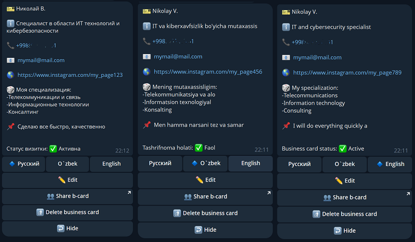
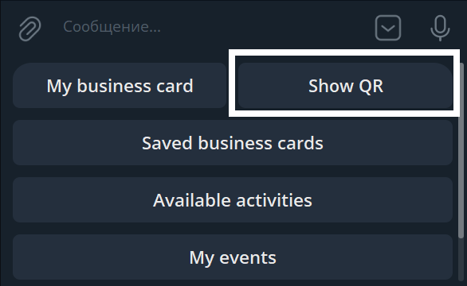
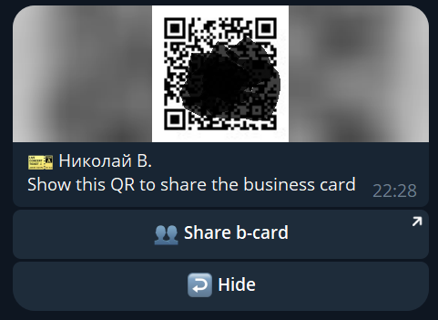
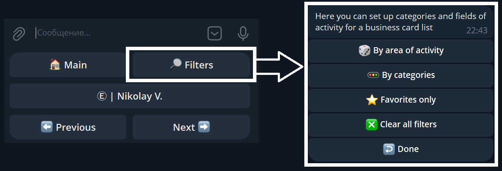
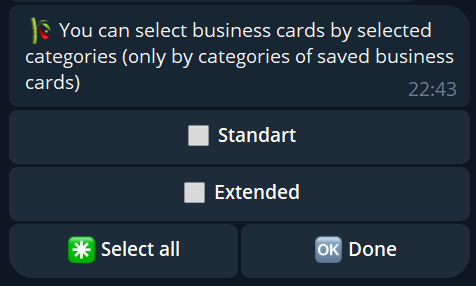
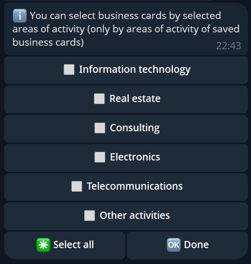

# "BCHolderbot" TELEGRAM BOT USER GUIDE

## TABLE OF CONTENTS

* [1. What is this bot used for?](#1-what-is-this-bot-used-for)
* [2. How to create a business card](#2-how-to-create-a-business-card)
* [3. How to fill in or edit your business card](#3-how-to-fill-in-or-edit-your-business-card)
* [4. How to share your business card with another person](#4-how-to-share-your-business-card-with-another-person)
* [5. How to delete your business card](#5-how-to-delete-your-business-card)
* [6. How to view your saved business cards](#6-how-to-view-your-saved-business-cards)
* [7. How to search among your saved business cards](#7-how-to-search-among-your-saved-business-cards)
* [8. How to change the bot interface language](#8-how-to-change-the-bot-interface-language)
* [9. How to view your profile information](#9-how-to-view-your-profile-information)
* [10. How to view the list of available events](#10-how-to-view-the-list-of-available-events)
* [11. How to create your own event](#11-how-to-create-your-own-event)
* [12. How to activate the "Extended" plan](#12-how-to-activate-the-extended-plan)
* [13. Miscellaneous](#13-miscellaneous)

### 1. What is this bot used for?
This Telegram bot is designed for storing and exchanging digital business cards directly within the Telegram messenger. It allows you to create your own digital card, share it with others, and collect cards that have been shared with you through the bot. All digital business cards are stored inside the service database and do not duplicate into your smartphone contacts or core Telegram messenger contacts. The bot enables you to find saved cards by business categories, subscription tiers, phone numbers, custom text queries, or by the initial letter. Additionally, you can retrieve a direct chat link to a user by entering their phone number, even if they are not in your phone or Telegram contact list (provided they are registered within the service and have not hidden their phone number in their core Telegram privacy settings).

### 2. How to create a business card
1. Press the **"Создать визитку"** (Create Card) button on the bot menu keyboard.
2. Press the **"Отправить контакт"** (Send Contact) button that appears — your business card will be created and populated automatically. 
3. Once created, your card can be customized. There are two tier plans available:
   * **Standart (Basic functionality):** Provides three primary fields: *«Заголовок»* (Title), *«Описание»* (Description), and *«Телефон»* (Phone number). The Title and Description fields can process and display plain text messages only. Any external links, images, voice notes, or video clips will be ignored by the system.
   * **Extended (Subscription):** Provides an expanded number of fields and unlocks the ability to insert clickable links to external websites or social media platforms, including inside the Description field.

### 3. How to fill in or edit your business card
1. Once your business card is initialized, the **"Моя визитка"** (My Card) button becomes available on the bot menu keyboard — press it.
2. In the opened card interface, press the **"Редактировать"** (Edit) button to modify the data fields.
3. Choose the specific section you want to adjust. The bot will prompt you to type in the details for that field — enter the text, hit send, and the info will update instantly. All other fields can be updated sequentially in the same manner.
* **Format restrictions:** Only plain text data is accepted. Other formats, such as voice notes, video files, images, etc., will be completely ignored by the system.

* **For Extended plan users:** The layout of available fields for editing depends on your subscription tier (Standart or Extended). With an active Extended subscription, you unlock a multi-language feature allowing you to fill out and store your card data in three languages simultaneously.

### 4. How to share your business card with another person
> *You can only share your business card if you have previously initialized and created it.*

There are two convenient methods to share your card:
* **Method 1 (In person via QR code):** Press the **"Показать QR"** (Show QR) button on the bot keyboard. The bot will instantly generate your unique QR code. Your contact just needs to scan this code with their smartphone camera — it will automatically prompt a direct link opening Telegram with your business card interface ready to be saved.
* **Method 2 (Remotely via link):** Press the **"Поделиться визиткой"** (Share Card) button located right beneath your generated QR code. Telegram will bring up a built-in menu to pick a chat with the specific user you want to message. Once they click the interactive link in the chat, it will display your digital business card.

| Main section button | QR Code menu interface |
| :---: | :---: |
|  |  |

### 5. How to delete your business card
1. Press the **"Моя визитка"** (My Card) button on the bot keyboard.
2. In the management control layout, press the **"Удалить визитку"** (Delete Card) button.
> *Warning: All your profile data will be permanently wiped from the service database. If you decide to use the bot again in the future, you will have to fill in all the data fields completely from scratch.*

### 6. How to view your saved business cards
1. Navigate to the **"Сохраненные визитки"** (Saved Cards) section on the bot keyboard.
2. Your collected contacts will be displayed in structured pages, showing 30 business cards per page.
3. Use the **"Следующие"** (Next) and **"Предыдущие"** (Previous) buttons to flip through pages. The list scrolls cyclically ("in a loop"). Search bars and advanced filtering options are accessible within this section.

When opening any specific business card from your list, you can add it to your Favorites or delete it from your digital cardholder.

### 7. How to search among your saved business cards
The bot provides a highly responsive interface for searching through your collected contact base:
* **Partial word search:** Just type in a part of a word contained within the title or description of a card. **Important:** Text query search is active across all main bot menus, except when you are in the middle of a data entry session (when the bot is actively waiting for you to type in data for a specific field edit).
* **Initial letter search:** If you text a single letter to the bot, it will return a list of all business cards that begin with that exact letter.
* **Phone number search:** Phone numbers must be typed out completely, in full international format (starting with a "+" sign, without spaces or hyphens).
* **Filters and data grouping:** Along with plain text search, you can apply targeted category filters. Go to **"Сохраненные визитки"** (Saved Cards) -> **"Отборы"** (Filters).

You can filter contacts by plan categories ("Extended" and "Standard"), as well as by operational industries specified on your partners' cards *(Note: setting up your own business industry category is unavailable on the Standart basic tier).*

| Category Filters | Industry Field Filters |
| :---: | :---: |
|  |  |

### 8. How to change the bot interface language
The Telegram bot supports three interface languages: Russian, Uzbek, and English. To modify your language preference, navigate to the **"Настройка"** (Settings) section on the bot keyboard, press the **"Изменить язык"** (Change Language) button, and select your preferred language option.

| Settings section interface | Language selection screen |
| :---: | :---: |
|  |  |

### 9. How to view your profile information
To monitor your current account data and subscription details, navigate to the **"Настройка"** (Settings) section and press the **"Профиль"** (Profile) button.  
Please keep in mind that a portion of advanced profile metrics and status visibility is hidden for basic Standart accounts.

### 10. How to view the list of available events
This search utility is accessible to **all bot users** without exception, allowing everyone to discover professional events, meetups, exhibitions, or seminars hosted by other community members.
* **How to browse:** Press the **"Доступные мероприятия"** (Available Events) button on the bot keyboard. 
* The system will pull up active events. Our targeting system auto-filters this list: if someone among your saved contacts is organizing an event, and your business card attributes line up with their specified entry restrictions (audience targeting), the event will pop up in your feed. You can open its card to inspect exact schedules and location details.

### 11. How to create your own event
*This operational feature requires an active premium Extended plan.*
1. Press the **"Мои мероприятия"** (My Events) button on the bot keyboard. 

2. The control board menu will load. To launch a brand new event posting, press the **"Создать мероприятие"** (Create Event) button and follow the step-by-step instructions.

3. Depending on your hosting history, the interface logs your postings across **"Активные"** (Active), **"Завершенные"** (Completed), and **"Отмененные"** (Canceled) categories. You can enter them to review data logs, adjust audience category settings, or refine specific industry access parameters.

All event management screens:

* **Limits and content moderation:** To maintain a clean community environment, one user account can host a maximum of 10 simultaneously active events. Every single created event undergoes mandatory manual review by our team and becomes visible to the wider community only after passing moderation. You can monitor the live validation status directly inside the event card layout.
* **Archiving window:** Completed or canceled postings remain viewable in your dashboard system for 7 days before being completely purged by the automatic database cleanup.

### 12. How to activate the "Extended" plan
If you haven't activated your premium tier yet, a **"Подключить Extended"** (Activate Extended) button will be visible on your main bot control keyboard (as shown in the default layout of basic users).

1. Press the **"Подключить Extended"** button. The bot will load a brief feature digest overview.

| Main keyboard activation entry | Plan description card |
|:---:|:---:|
|  |  |

2. To proceed further, click the inline **"Подключить Extended"** button directly beneath the description card, then select your desired duration tier (1, 3, 6, or 12 months). The interface processes payments in local currency (UZS) or via Telegram Stars.

| Price layout options in UZS | Price layout options in Stars |
| :---: | :---: |
|  |  |

3. **Payment processing channels:**
   * Selecting local UZS currency routing will prompt you to choose between popular national payment integrations — **Click** or **Payme**, generating an official checkout invoice link.
   * Selecting Stars routing will initialize the official, built-in native Telegram checkout interface window.

| Payment gateway choice (Click / Payme) | National currency invoice check | Telegram Stars invoice check |
| :---: | :---: | :---: |
|  |  |  |

### 13. Miscellaneous
* The service workflows are completely intuitive: every background command or interface change is supported by explicit status updates or context-aware system instructions.
* **In case of runtime bugs or freezes:** Simply restart the bot instance by sending the standard Telegram `/start` command. If an interface issue persists, tap the dedicated technical support bot link embedded directly inside the profile header of our service description.
* Our system capabilities, integration extensions, and database tools are constantly being upgraded. Our engineering support desk traces live system log exceptions in real time and implements automated patch updates regardless of whether an end-user files a formal bug report. On rare occasions, a support specialist might reach out to your account directly to clarify complex edge-case interface anomalies and fast-track a system resolution for you.
