# СПРАВОЧНАЯ ПОДДЕРЖКА ТЕЛЕГРАМ-БОТА «BCHolderbot»

### 1. Для чего нужен этот бот
Этот Телеграм-бот предназначен для хранения и обмена электронными визитками внутри мессенджера Телеграм. Он позволяет создать свою визитку и делиться ей с другими людьми, а также сохранять чужие визитки, которыми с вами поделились посредством бота. 

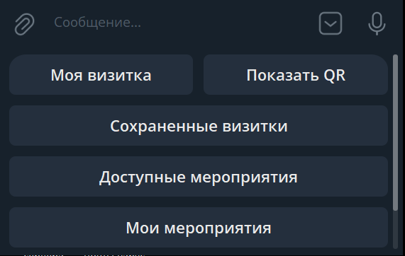

* **Где хранятся данные:** Все визитки находятся внутри сервиса и не дублируются в контактах вашего телефона или самого мессенджера Телеграм.
* **Как делиться:** Путем отправки ссылки на свою визитку другому пользователю либо с помощью QR-кода, который является уникальным для каждой визитки.
* **Как работает поиск:** Бот позволяет найти визитку по видам деятельности, категориям, номеру телефона или по произвольной строке. **Важно:** Поиск работает только в рамках сохраненных Вами визиток. 
* **Исключение для поиска по номеру телефона:** Если вы ищете контакт по полному номеру телефона, и его нет в вашей визитнице, бот все равно сможет вернуть прямую ссылку на чат с этим собеседником (при условии, что он зарегистрирован в сервисе и не скрыл свой номер в настройках приватности самого Телеграм). Это позволит написать человеку, даже если его номера нет в контактах вашего телефона.

### 2. Как создать визитку
1. Нажмите кнопку **«Создать визитку»** на клавиатуре бота.
2. Нажмите появившуюся кнопку **«Отправить контакт»** — визитка будет создана и заполнена автоматически. 
3. После создания её можно отредактировать. Доступно два тарифных плана:
   * **Standart (Базовый функционал):** Предусмотрено три поля: *«Заголовок»*, *«Описание»* и *«Телефон»*. Поля «Заголовок» и «Описание» могут хранить только текстовые сообщения. Любые внешние ссылки, картинки, голос и видео системой игнорируются.
   * **Extended (Подписка):** Предусматривает расширенное количество полей и открывает возможность указания кликабельных ссылок на внешние ресурсы, в том числе внутри поля «Описание».

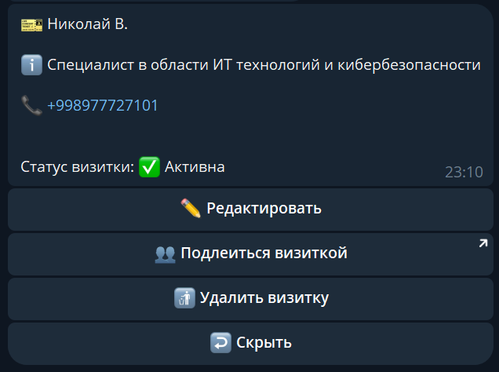

### 3. Как наполнить визитку информацией
1. После того как визитка создана, на клавиатуре бота появится кнопка **«Моя визитка»** — нажмите на неё.
2. В открывшейся карточке визитки нажмите кнопку **«Редактировать»** для изменения полей.
3. Выберите конкретный раздел, который хотите изменить. Бот запросит ввод информации для этого поля — введите текст, отправьте сообщение, и данные обновятся. Аналогичным образом редактируются все остальные поля.

### 4. Как поделиться визиткой с другим человеком
> *Поделиться визиткой можно только в том случае, если вы предварительно её создали.*

* **Способ 1 (Через QR-код):** Нажмите кнопку **«Показать QR»** на клавиатуре бота. Бот пришлет ваш уникальный QR-код. Другой человек должен считать его камерой своего телефона — после считывания у него откроется Телеграм с вашей визиткой, и он сможет её сохранить.
* **Способ 2 (Через ссылку):** Нажмите кнопку **«Поделиться»**, которая находится прямо под сгенерированным QR-кодом. Телеграм предложит вам выбрать чат с конкретным пользователем, с которым вы хотите поделиться ссылкой. При переходе по этой ссылке у него также откроется Телеграм с вашей визиткой.

### 5. Как изменить язык интерфейса бота
В Телеграм-боте доступны три языка интерфейса: русский, узбекский и английский. 
* **Инструкция:** Перейдите в раздел **«Настройка»** на клавиатуре бота, нажмите кнопку **«Изменить язык»** и выберите подходящий вам вариант.

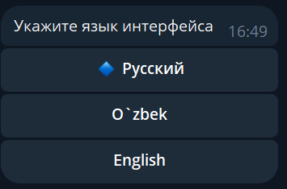

### 6. Как посмотреть информацию о профиле
* **Инструкция:** Перейдите в раздел **«Настройка»** и нажмите кнопку **«Профиль»**. 

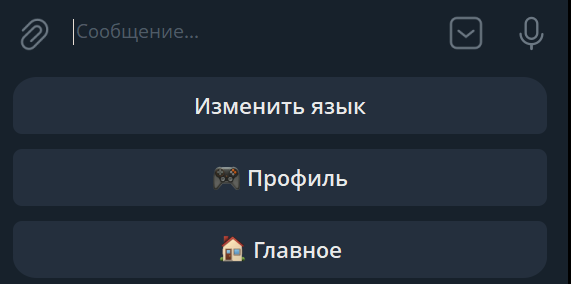

Пожалуйста, учитывайте, что часть расширенной информации о профиле недоступна на бесплатном тарифе Standart.

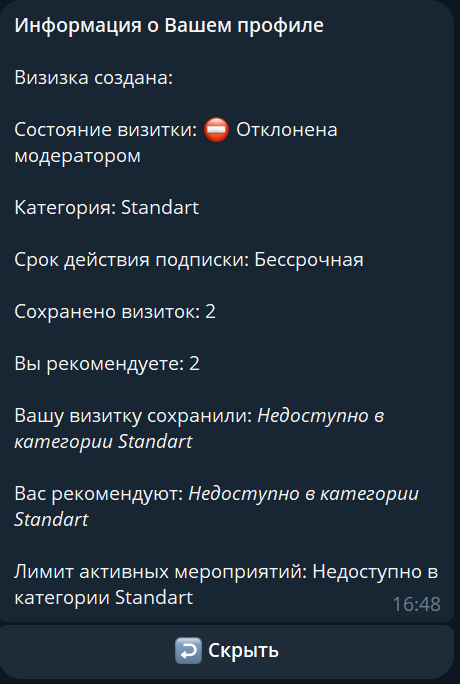

### 7. Как изменить информацию в своей визитке
1. Нажмите кнопку **«Моя визитка»** на клавиатуре бота, а затем в меню управления выберите **«Редактировать»**.
2. В появившейся клавиатуре нажмите на кнопку с тем полем, которое требует изменений. Бот запросит новое значение — отправьте его текстовым сообщением.
* **Ограничения по формату:** Можно использовать только текстовые значения. Иные данные, такие как голосовые сообщения, видео, изображения и т.д., будут автоматически проигнорированы сервисом.
* **Для тарифа Extended:** Перечень доступных для редактирования полей отличается в зависимости от вашей подписки (Standart или Extended). При наличии подписки Extended вам открывается возможность создания и заполнения визитки сразу на трех языках.

### 8. Как удалить визитку
1. Нажмите кнопку **«Моя визитка»** на клавиатуре бота.
2. В меню управления нажмите кнопку **«Удалить визитку»**.
> *Внимание: Все данные удаляются из системы безвозвратно. Если вы захотите создать визитку повторно, все поля придется заполнять с самого начала.*

### 9. Как посмотреть список доступных мероприятий
Эта функция доступна **всем пользователям бота** и позволяет находить события, которые планируют провести другие участники.
* **Инструкция:** Нажмите кнопку **«Доступные мероприятия»** на клавиатуре бота. 
* Если кто-то из контактов, которые вы уже сохранили в своей визитнице, проводит мероприятие, и ваша визитка соответствует установленным им ограничениям (таргетингу), это событие отобразится в вашем списке. Вы сможете открыть его, чтобы посмотреть подробности проведения и точные даты.

### 10. Как создать свое мероприятие
*Данный функционал доступен только пользователям с активным тарифом Extended.*
1. Перейдите в раздел **«Мои мероприятия»** на клавиатуре бота. 

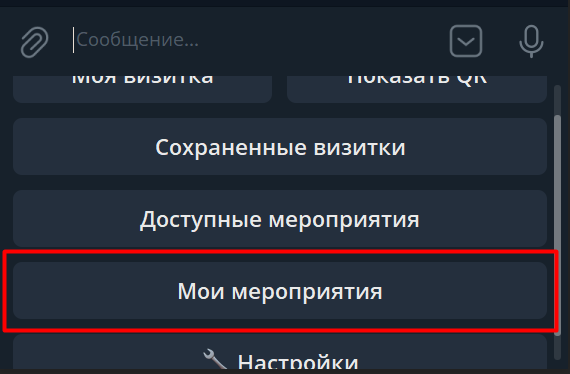

2. Перед вами откроется меню управления. Для создания нового события нажмите кнопку **«Создать мероприятие»** и следуйте инструкциям бота.

3. В зависимости от истории ваших событий здесь будут отображены разделы **«Активные»**, **«Завершенные»** и **«Отмененные»**, внутри которых можно просматривать списки соответствующих прошлых мероприятий, настраивать ограничения видимости по категориям или сферам деятельности сохраненных визиток.

* **Лимиты и модерация:** Вы можете иметь не более 10 одновременно активных мероприятий. Каждое созданное мероприятие в обязательном порядке проходит модерацию и становится доступно другим участникам сообщества только в случае её положительного прохождения. Текущее состояние модерации всегда отображается внутри карточки самого мероприятия.
* **Архив:** Завершенные и отмененные события хранятся в системе в течение 7 дней, после чего автоматически удаляются без возможности восстановления.

### 11. Как просмотреть уже сохраненные визитки
1. Перейдите в раздел **«Сохраненные визитки»** на клавиатуре бота.
2. Список контактов отображается порциями — по 30 визиток на каждой странице.

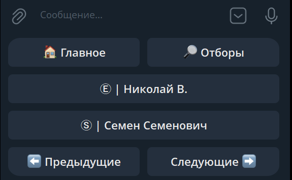

3. Для перемещения между страницами используйте команды **«Следующие»** и **«Предыдущие»**. Список прокручивается циклично («по кругу»). В этом же разделе доступны поиск и отборы.

При открытии конкретной визитки из списка вы можете добавить её в избранные или удалить.

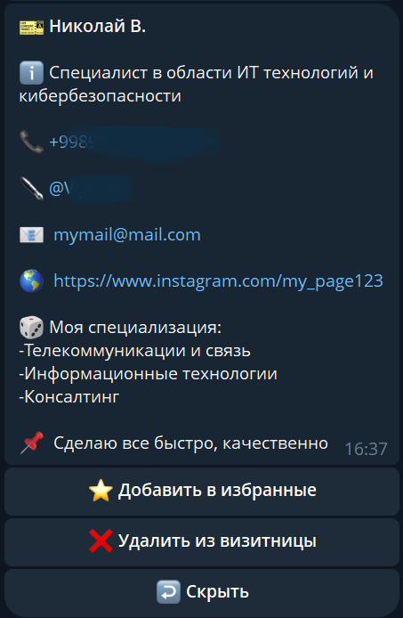

### 12. Как искать визитки среди уже сохраненных
Бот предоставляет гибкий интерфейс для работы с вашей базой контактов:
* **Поиск по части слова:** Введите часть слова, которое содержится в заголовке или описании визитки. **Важно:** Поиск по части слова работает из любого меню бота, за исключением режима ввода и запроса данных (когда бот ожидает от вас заполнения какого-то поля).
* **Поиск по первой букве:** Если отправить боту всего одну букву, на экране отобразятся только те визитки, которые начинаются с этой буквы.
* **Поиск по номеру телефона:** Номер телефона необходимо вводить полностью, в международном формате (обязательно со знаком «+» и без пробелов).
* **Фильтры и отборы:** Помимо текстового поиска, вы можете использовать точечный отбор. Для этого перейдите в раздел **«Сохраненные визитки»** -> **«Отборы»**.

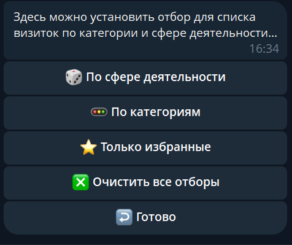

Вы сможете отфильтровать контакты по категориям («Extended» и «Standard»), а также по сферам деятельности, которые указаны в сохраненных вами визитках.

| Отбор по категориям | Отбор по сферам деятельности |
| :---: | :---: |
| 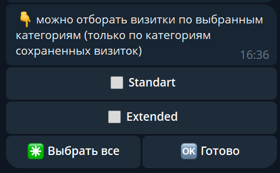 | 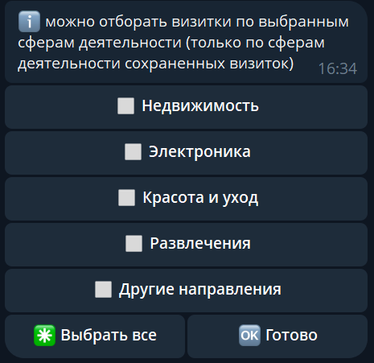 |

*(Напоминаем, что указание сферы деятельности в собственном профиле недоступно для категории Standart).*

### 13. Как подключить тариф «Extended»
Если тариф у вас еще не активирован, на главной клавиатуре бота будет доступна кнопка **«Подключить Extended»** (как показано на экране главного меню для базового тарифа).

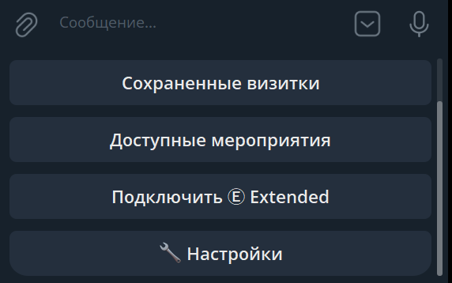

1. Нажмите кнопку **«Подключить Extended»**. Бот выведет краткое описание преимуществ.

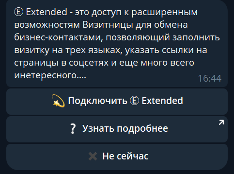

2. Выберите подходящий период подписки (1, 3, 6 или 12 месяцев). Система предложит варианты оплаты в национальной валюте (UZS) или Звездами Телеграм.

| Сетка тарифов в UZS | Сетка тарифов в Stars |
| :---: | :---: |
| 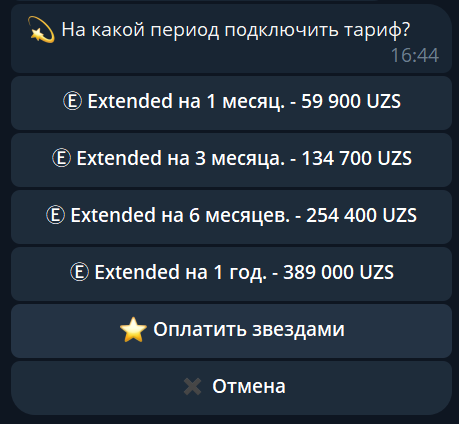 | 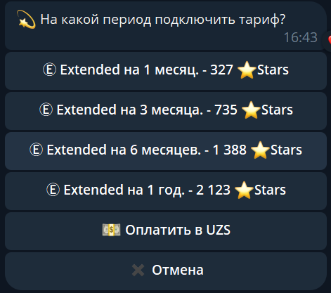 |

3. **Процесс оплаты:**
   * При выборе оплаты в UZS бот предложит выбрать платежную систему — **Click** или **Payme**, после чего выставит счет.
   * При выборе оплаты Звездами система выставит стандартный инвойс мессенджера Телеграм.

| Выбор шлюза (Click / Payme) | Инвойс в UZS | Инвойс в Stars |
| :---: | :---: | :---: |
| 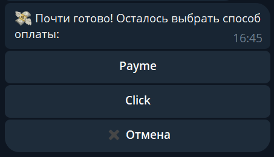 | 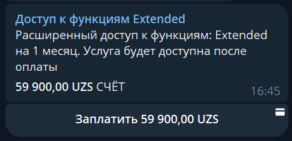 | 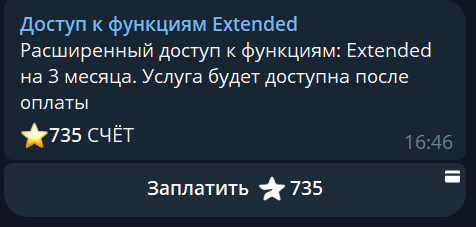 |

### 14. Прочее
* Наш сервис устроен интуитивно: каждая команда бота обязательно сопровождается понятным текстовым комментарием или наводящим вопросом.
* **В случае возникновения ошибок или зависаний:** Просто перезапустите бота, отправив команду `/start`. Если ошибка сохраняется и после перезапуска, напишите нам в специальный бот поддержки, ссылка на который всегда доступна в шапке профиля сервиса.
* Функционал сервиса постоянно совершенствуется, расширяется и улучшается. Наша команда поддержки видит все технические ошибки, происходящие во время работы системы, в режиме реального времени и принимает меры для их оперативного устранения вне зависимости от того, поступали ли от пользователей официальные обращения. В отдельных редких случаях специалисты команды поддержки могут связаться с вами самостоятельно для уточнения деталей технической проблемы и её скорейшего решения.
