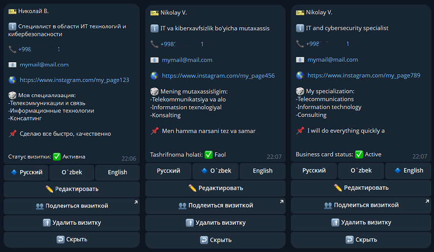
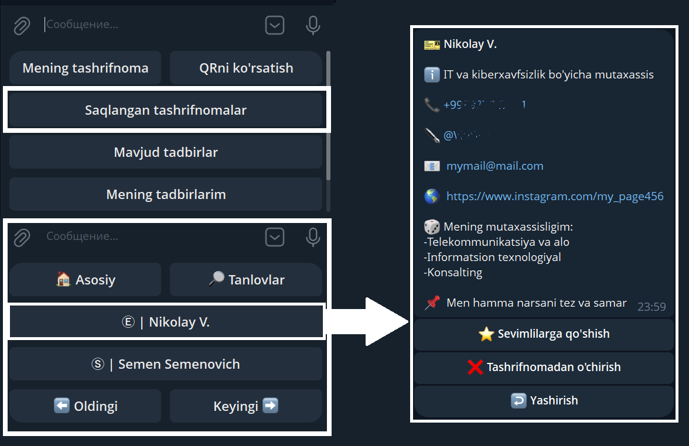
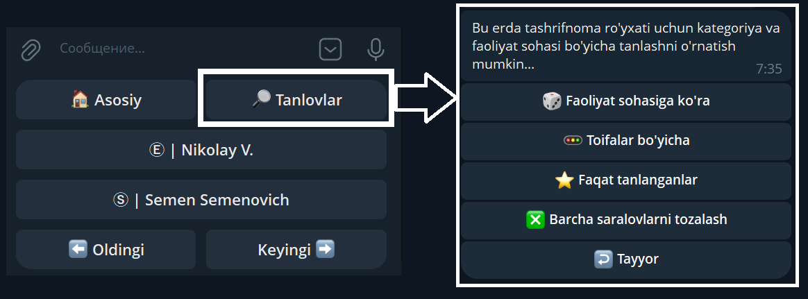
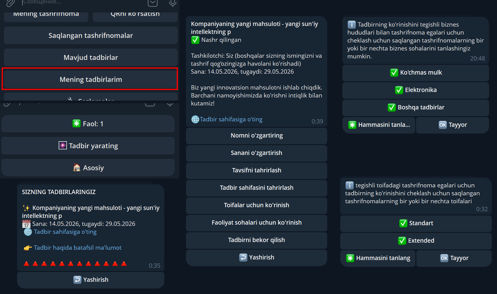

# «BCHolderbot» TELEGRAM-BOTIDAN FOYDALANISH BOʻYICHA YOʻRIQNOMA

## MUNDARIJA

* [1. Bu bot nima uchun kerak?](#1-bu-bot-nima-uchun-kerak)
* [2. Tashrifnomani (vizitkani) qanday yaratish lozim?](#2-Tashrifnomani-vizitkani-qanday-yaratish-lozim)
* [3. Tashrifnomani qanday toʻldirish yoki oʻzgartirish mumkin?](#3-Tashrifnomani-qanday-toʻldirish-yoki-oʻzgartirish-mumkin)
* [4. Tashrifnomani boshqa shaxsga qanday yuborish mumkin?](#4-Tashrifnomani-boshqa-shaxsga-qanday-yuborish-mumkin)
* [5. Tashrifnomani qanday oʻchirish lozim?](#5-tashrifnomani-qanday-oʻchirish-lozim)
* [6. Saqlangan tashrifnomalarini qanday koʻrish mumkin?](#6-saqlangan-tashrifnomalarini-qanday-koʻrish-mumkin)
* [7. Saqlangan tashrifnomalari orasidan qidiruvni qanday amalga oshirish lozim?](#7-saqlangan-tashrifnomalari-orasidan-qidiruvni-qanday-amalga-oshirish-lozim)
* [8. Bot interfeysi tilini qanday oʻzgartirish mumkin?](#8-bot-interfeysi-tilini-qanday-oʻzgartirish-mumkin)
* [9. Profil ma’lumotlarini qanday koʻrish lozim?](#profile)
* [10. Mavjud tadbirlar roʻyxatini qanday koʻrish mumkin?](#10-mavjud-tadbirlar-roʻyxatini-qanday-koʻrish-mumkin)
* [11. Shaxsiy tadbirni qanday yaratish lozim?](#11-shaxsiy-tadbirni-qanday-yaratish-lozim)
* [12. «Extended» tarifiga qanday ulanish mumkin?](#12-extended-tarifiga-qanday-ulanish-mumkin)
* [13. Boshqa masalalar](#13-boshqa-masalalar)

### 1. Bu bot nima uchun kerak?
Ushbu Telegram-bot Telegram messenjeri ichida elektron tashrifnomalarini saqlash va almashish uchun moʻljallangan. U sizga shaxsiy vizitkangizni yaratish, uni boshqalar bilan baham koʻrish, shuningdek, bot orqali sizga yuborilgan begona vizitkalarni saqlab qoʻyish imkonini beradi. Barcha vizitkalar servis ichida saqlanadi hamda telefoningiz kontaktlarida yoki Telegram messenjerining oʻzida nusxalanmaydi (shaxsiy kontaktlarga aralashmaydi). Bot saqlangan vizitkalarni faoliyat turlari, kategoriyalar, telefon raqami, ixtiyoriy matn satri yoki bosh harf boʻyicha izlash, shuningdek, telefon raqami orqali suhbatdosh bilan muloqot chatiga oʻtish havolasini olish imkonini beradi — bunda ushbu raqam telefoningiz kontaktlarida yoki Telegram-da saqlanmagan boʻlsa ham chatga oʻtish mumkin (foydalanuvchi servisda roʻyxatdan oʻtgan va Telegram maxfiylik sozlamalarida oʻz raqamini yashirmagan boʻlishi shart).

### 2. Tashrifnomani (vizitkani) qanday yaratish lozim?
1. Bot klaviaturasidagi **«Создать визитку»** (Tashrifnomani yaratish) tugmasini bosing.
2. Paydo boʻlgan **«Отправить контакт»** (Kontaktni yuborish) tugmasini bosing — vizitka avtomatik ravishda yaratiladi va toʻldiriladi. 
3. Yaratilgandan soʻng uni tahrirlash mumkin. Foydalanish uchun ikkita tarif rejasi mavjud:
   * **Standart (Asosiy funksionallik):** Uchta maydon koʻzda tutilgan: *«Заголовок»* (Sarlavha), *«Описание»* (Tavsif) va *«Телефон»* (Telefon). «Sarlavha» va «Tavsif» maydonlarida faqat matnli xabarlar saqlanishi mumkin. Har qanday tashqi havolalar, rasmlar, ovozli xabarlar va videolar tizim tomonidan rad etiladi (inobatga olinmaydi).
   * **Extended (Obuna):** Kengaytirilgan maydonlar sonini taqdim etadi va tashqi resurslarga bosiluvchi (klika优先) havolalarni, shu jumladan «Tavsif» maydonining ichiga joylashtirish imkoniyatini ochadi.

### 3. Tashrifnomani qanday toʻldirish yoki oʻzgartirish mumkin?
1. Vizitka yaratilgandan soʻng, bot klaviaturasida **«Моя визитка»** (Mening vizitkam) tugmasi paydo boʻladi — uni bosing.
2. Ochilgan vizitka kartochkasida maydonlarni oʻzgartirish uchun **«Редактировать»** (Tahrirlash) tugmasini bosing.
3. Oʻzgartirmoqchi boʻlgan muayyan boʻlimni tanlang. Bot ushbu maydon uchun ma’lumot kiritishni soʻraydi — matnni yozib, xabar qilib yuboring, shunda ma’lumotlar yangilanadi. Boshqa barcha maydonlar ham xuddi shu tarzda tahrirlanadi.
* **Format boʻyicha cheklovlar:** Faqat matnli qiymatlardan foydalanish mumkin. Ovozli xabarlar, video, tasvirlar va shunga oʻxshash boshqa ma’lumotlar bot tomonidan inobatga olinmaydi.

* **Extended tarifi uchun:** Tahrirlash mumkin boʻlgan maydonlar roʻyxati sizning tarifingizga (Standart yoki Extended) qarab farq qiladi. Extended obunasi mavjud boʻlganda, vizitkani bir vaqtning oʻzida uchta tilda yaratish va toʻldirish imkoniyati ochiladi.

### 4. Tashrifnomani boshqa shaxsga qanday yuborish mumkin?
> *Tashrifnomani faqat uni oldindan yaratib qoʻygan boʻlsangizgina boshqalar bilan baham koʻrishingiz mumkin.*

* **1-usul (QR-kod orqali):** Bot klaviaturasidagi **«Показать QR»** (QR-kodni koʻrsatish) tugmasini bosing. Bot sizning unikal QR-kodingizni yuboradi. Suhbatdoshingiz ushbu kodni oʻz telefon kamerasi orqali skaner qilishi lozim — skaner qilingandan soʻng uning telefonida sizning vizitkangiz ochiladi va u vizitkani saqlab olishi mumkin boʻladi.
* **2-usul (Havola orqali):** Sakkiz burchakli QR-kod tagida joylashgan **«Поделиться визиткой»** (Vizitkani ulashish) tugmasini bosing. Telegram sizga havolani yubormoqchi boʻlgan muayyan foydalanuvchi bilan chatni tanlashni taklif qiladi. Ushbu havola orqali oʻtilganda ham suhbatdoshingizda sizning vizitkangiz aks etadi.

| Asosiy boʻlim tugmasi | Variantlar tanloviga ega QR-kod |
| :---: | :---: |
|  |  |

### 5. Tashrifnomani qanday oʻchirish lozim?
1. Bot klaviaturasidagi **«Моя визитка»** (Mening vizitkam) tugmasini bosing.
2. Boshqaruv menyusida **«Удалить визитку»** (Vizitkani oʻchirish) tugmasini bosing.
> *Diqqat: Barcha ma’lumotlar tizimdan qayta tiklanmaydigan qilib oʻchiriladi. Agar kelgusida vizitkani qayta yaratmoqchi boʻlsangiz, barcha maydonlarni boshidan toʻldirishingizga toʻgʻri keladi.*

### 6. Saqlangan tashrifnomalarini qanday koʻrish mumkin?
1. Bot klaviaturasidagi **«Сохраненные визитки»** (Saqlangan vizitkalar) boʻlimiga oʻting.
2. Kontaktlar roʻyxati qismlarga boʻlingan holda — har bir sahifada 30 tadan vizitka shaklida koʻrsatiladi.
3. Sahifalar oʻrtasida harakatlanish uchun **«Следующие»** (Keyingilar) va **«Предыдущие»** (Oldingilar) buyruqlaridan foydalaning. Roʻyxat aylanma shaklda («doira boʻylab») varaqlanadi. Ushbu boʻlimning oʻzida qidiruv va filtrlash (saralash) imkoniyatlari mavjud.

Roʻyxatdan muayyan vizitkani ochganingizda, uni saralanganlarga (sevimlilarga) qoʻshishingiz yoki saqlanganlar qatoridan oʻchirib tashlashingiz mumkin.

### 7. Saqlangan tashrifnomalari orasidan qidiruvni qanday amalga oshirish lozim?
Bot kontaktlar bazasi bilan ishlash uchun moslashuvchan qidiruv interfeysini taqdim etadi:
* **Soʻz qismi boʻyicha qidirish:** Vizitkaning sarlavhasi yoki tavsifida mavjud boʻlgan soʻzning bir qismini kiriting. **Muhim:** Soʻz qismi boʻyicha qidiruv botning istalgan menyusidan ishlaydi, ma’lumot kiritish va soʻrov rejimi (bot sizdan biror maydonni toʻldirishni kutayotgan payt) bundan mustasno.
* **Birinchi harf boʻyicha qidirish:** Agar botga bor-yoʻgʻi bitta harf yuborsangiz, ekranda faqat ushbu harf bilan boshlanadigan vizitkalar koʻrsatiladi.
* **Telefon raqami boʻyicha qidirish:** Telefon raqamini xalqaro formatda, toʻliq kiritish lozim (albatta «+» belgisi bilan va boʻshliqlarsiz).
* **Filtrlar va saralashlar:** Matnli qidiruvdan tashqari, siz aniq mezonlar boʻyicha saralashdan foydalanishingiz mumkin. Buning uchun **«Сохраненные визитки»** (Saqlangan vizitkalar) -> **«Отборы»** (Saralashlar) boʻlimiga oʻting.

Siz kontaktlarni kategoriyalar («Extended» va «Standard»), shuningdek, saqlangan vizitkalarda koʻrsatilgan faoliyat sohalari boʻyicha saralashingiz mumkin *(Oʻz profilingizda faoliyat sohasini koʻrsatish Standart kategoriyasi uchun mavjud emas).*

| Kategoriyalar boʻyicha saralash | Faoliyat sohalari boʻyicha saralash |
| :---: | :---: |
|  |  |

### 8. Bot interfeysi tilini qanday oʻzgartirish mumkin?
Telegram-botda uchta interfeys tili mavjud: ruscha, oʻzbekcha va inglizcha. Interfeys tilini oʻzgartirish uchun bot klaviaturasidagi **«Настройка»** (Sozlamalar) boʻlimiga oʻting, **«Изменить язык»** (Tilni oʻzgartirish) tugmasini bosing va oʻzingizga mos tilni tanlang.

| Sozlamalar boʻlimi | Tilni tanlash |
| :---: | :---: |
|  |  |

### 9. Profil ma’lumotlarini qanday koʻrish lozim?
Profil haqidagi ma’lumotlarni koʻrish uchun **«Настройка»** (Sozlamalar) boʻlimiga oʻting va **«Профиль»** (Profil) tugmasini bosing.  
Profilga oid kengaytirilgan ma’lumotlarning bir qismi bepul Standart tarifida koʻrsatilmaydi.

### 10. Mavjud tadbirlar roʻyxatini qanday koʻrish mumkin?
Ushbu funksiya **botning barcha foydalanuvchilari uchun** ochiq boʻlib, boshqa ishtirokchilar tomonidan oʻtkazilishi rejalashtirilgan tadbirlarni topish imkonini beradi.
* **Qanday koʻrish mumkin:** Bot klaviaturasidagi **«Доступные мероприятия»** (Mavjud tadbirlar) tugmasini bosing. 
* Agar siz oʻz vizitnicangizda saqlab qoʻygan kontaktlardan birortasi tadbir oʻtkazayotgan boʻlsa va sizning vizitkangiz u belgilangan cheklovlarga (maqsadli auditoriyaga) mos kelsa, ushbu tadbir roʻyxatda aks etadi. Uni ochib, oʻtkazilish tafsilotlari va aniq sanalari bilan tanishishingiz mumkin.

### 11. Shaxsiy tadbirni qanday yaratish lozim?
*Ushbu funksiya faqat faol Extended tarifi boʻlgan foydalanuvchilar uchun mavjud.*
1. Bot klaviaturasidagi **«Моои мероприятия»** (Mening tadbirlarim) boʻlimiga oʻting. 

2. Sizning qarshingizda boshqaruv menyusi ochiladi. Yangi tadbir yaratish uchun **«Создать мероприятие»** (Tadbir yaratish) tugmasini bosing va bot yoʻriqnomalariga amal qiling.

3. Tadbirlaringiz tarixiga qarab, bu yerda **«Активные»** (Faollar), **«Завершенные»** (Yuborilganlar/Yakunlanganlar) va **«Отмененные»** (Bekor qilinganlar) boʻlimlari koʻrinadi. Ularning ichida tegishli oʻtgan tadbirlar roʻyxatini koʻrish, saqlangan vizitkalarning kategoriyalari yoki faoliyat sohalari boʻyicha koʻrinish cheklovlarini sozlash mumkin. 

Tadbirlarni boshqarishning barcha ekranlari:

* **Cheklovlar va moderatsiya:** Bir vaqtning oʻzida 10 tadan koʻp boʻlmagan faol tadbirga ega boʻlishingiz mumkin. Har bir yaratilgan tadbir majburiy tartibda moderatsiyadan (tekshiruvdan) oʻtadi va faqat u muvaffaqiyatli yakunlangandan keyingina hamjamiyatning boshqa ishtirokchilariga koʻrinadi. Moderatsiya holatini har doim tadbirning kartochkasi ichida koʻrib turish mumkin.
* **Arxiv:** Yakunlangan va bekor qilingan tadbirlar tizimda 7 kun davomida saqlanadi, shundan soʻng qayta tiklanmaydigan qilib avtomatik ravishda oʻchiriladi.

### 12. «Extended» tarifiga qanday ulanish mumkin?
Agar tarif hali faollashtirilmagan boʻlsa, botning asosiy klaviaturasida **«Подключить Extended»** (Extended-ni ulashing) tugmasi mavjud boʻladi (huddi standart tarif uchun asosiy menyu ekranida koʻrsatilganidek).

1. **«Подключить Extended»** tugmasini bosing. Bot tarif imkoniyatlarining qisqacha tavsifini koʻrsatadi.

| Asosiy klaviaturadagi ulanish tugmasi | Tarif tavsifi |
|:---:|:---:|
|  |  |

2. Davom etish uchun tavsif ostidagi klaviaturada yana bir bor **«Подключить Extended»** tugmasini bosing va mos keluvchi obuna muddatini (1, 3, 6 yoki 12 oy) tanlang. Servis milliy valyutada (UZS) yoki Telegram Yulduzlari (Stars) orqali toʻlov variantlarini taklif etadi.

| UZS dagi tariflar tarmogʻi | Stars dagi tariflar tarmogʻi |
| :---: | :---: |
|  |  |

3. **Toʻlov jarayoni:**
   * UZS orqali toʻlov tanlanganda, bot toʻlov tizimini — **Click** yoki **Payme**-ni tanlashni soʻraydi, shundan soʻng hisobni shakllantiradi.
   * Yulduzlar (Stars) orqali toʻlov tanlanganda, tizim Telegram messenjerining standart hisob-fakturasini chiqaradi.

| Shlyuz tanlovi (Click / Payme) | UZS dagi hisob | Stars dagi hisob |
| :---: | :---: | :---: |
|  |  |  |

### 13. Boshqa masalalar
* Servis intuitiv tushunarli tarzda tuzilgan: botning har bir buyrugʻi albatta matnli sharh yoki savol bilan birga keladi.
* **Xatoliklar yuzaga kelganda yoki bot qotib qolganda:** Botga `/start` buyrugʻini yuborish orqali uni qayta ishga tushiring. Agar muammo qayta ishga tushirilgandan keyin ham saqlanib qolsa, servis profilining sarlavhasida (shapkasida) koʻrsatilgan maxsus qoʻllab-quvvatlash botiga yozing.
* Servis funksionalligi doimiy ravishda takomillashtirilmoqda, kengaytirilmoqda va yaxshilanmoqda. Bizning texnik guruhimiz tizim ishida sodir boʻlayotgan barcha texnik xatoliklarni real vaqt rejimida koʻrib turadi va foydalanuvchilardan rasmiy murojaat kelib tushishidan qat’i nazar, ularni tezkorlik bilan bartaraf etish choralarini koʻradi. Ayrim kamdan-kam hollarda, yuzaga kelgan texnik muammoni aniqlashtirish va uni imkon qadar tezroq hal qilish uchun qoʻllab-quvvatlash xizmati mutaxassislari siz bilan mustaqil ravishda bogʻlanishlari mumkin.
